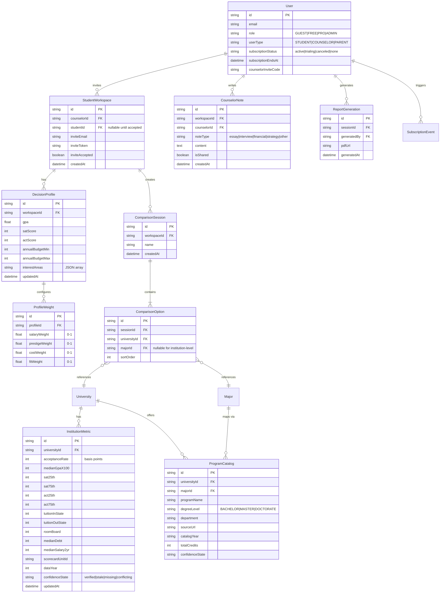

# CollegeFlow MVP v1 — Implementation Plan

**Epic**: College Decision Workspace MVP
**Feature**: Counselor-Invited Student Comparison + Branded Report
**Date**: 2026-05-27
**Version**: 1.0
**Source**: `docs/prd/MVP-SCOPE.md`

---

## Goal

Build a counselor-invited student workspace where counselors can invite students, students complete a basic decision profile, counselors can compare 2-4 school/program options across 4 data lenses (Admissions, Outcomes, Cost, Fit), and generate a branded PDF report for family meetings. Data covers top 50 US universities using College Scorecard, CDS, and IPEDS sources. This validates the core hypothesis that counselors will distribute the platform and families will pay for the Decision Workspace.

---

## Requirements

### Functional Requirements

1. **Auth**: Student and Counselor roles via better-auth with email/password
2. **Onboarding**: 3-step wizard (role selection, academic/budget inputs, preference weights)
3. **Decision Profile**: GPA, test scores, budget range, interest signals, adjustable weights for salary/prestige/fit/cost
4. **Institution Data**: Top 50 US universities with IPEDS identity, CDS admissions/cost data, College Scorecard outcomes
5. **Program Catalogs**: Major programs per university mapped to CIP codes
6. **Comparison Engine**: 4 lenses — Admissions, Outcomes, Cost, Fit — comparing 2-4 Decision Options
7. **Fit Engine**: Rule-based scoring comparing student profile against program attributes
8. **Confidence System**: Verified / Stale / Missing / Conflicting data states
9. **Counselor CRM**: Dashboard showing invited students, invite-by-email flow, student progress overview
10. **PDF Reports**: Branded single-page comparison report exportable as PDF
11. **Entitlement**: Free tier (1 student, 1 comparison), Pro ($19/mo unlimited), Counselor ($49/mo up to 50 students)

### Non-Functional Requirements

- Time-to-value: Student onboarding → first comparison < 5 minutes
- Support top 50 US universities only for v1
- Mobile-responsive (counselors work on iPad/laptop, students on phone)
- PDF generation < 3 seconds
- Comparison page renders < 2 seconds with 4 options

---

## Technical Considerations

### System Architecture Overview

```mermaid
graph TB
    subgraph "Frontend Layer (Next.js 14 / React 19)"
        UI[React Components]
        State[Zustand State]
        Router[Next.js App Router]
        PDF[@react-pdf/renderer]
    end

    subgraph "API Layer (Express 4)"
        Auth[better-auth middleware]
        Routes[Express Routes]
        Validate[zod validation]
        Stripe[Stripe webhook]
    end

    subgraph "Business Logic Layer"
        Profile[Decision Profile Service]
        Compare[Comparison Engine]
        Fit[Fit Scoring Service]
        CRM[Counselor CRM Service]
        Report[PDF Report Generator]
        Entitlement[Entitlement Gate Service]
    end

    subgraph "Data Layer"
        Prisma[Prisma ORM]
        Scorecard[College Scorecard Data]
        CDS[CDS Data]
        IPEDS[IPEDS Identity Data]
    end

    subgraph "Infrastructure"
        Docker[Docker containers]
        Postgres[PostgreSQL 15]
        Redis[Redis for caching]
    end

    UI --> Router
    Router --> Auth
    Auth --> Routes
    Routes --> Validate
    Validate --> Profile
    Validate --> Compare
    Validate --> CRM
    Validate --> Entitlement
    Profile --> Prisma
    Compare --> Fit
    Compare --> Prisma
    Fit --> Prisma
    CRM --> Prisma
    Report --> PDF
    Entitlement --> Stripe
    Prisma --> Postgres
    Scorecard --> Postgres
    CDS --> Postgres
    IPEDS --> Postgres
    Redis -. cache .-> Routes
```

### Technology Stack

| Layer | Technology | Rationale |
|-------|-----------|-----------|
| Frontend | Next.js 14 (App Router) + React 19 | Already in codebase (`src/pages/`) |
| State | Zustand | Lightweight, already likely used |
| UI Components | shadcn/ui + Tailwind | Standard for modern React apps |
| Backend API | Express 4 | Already in codebase (`server/server.ts`) |
| Auth | better-auth | Already in codebase and Prisma schema |
| Database | PostgreSQL 15 + Prisma | Already in codebase (`prisma/schema.prisma`) |
| Payments | Stripe | Industry standard for SaaS subscriptions |
| PDF | @react-pdf/renderer | Server-side PDF generation |
| Caching | Redis | Comparison result caching |
| Data Ingestion | Python (existing backend) | Existing `backend/` Python pipeline |

### Integration Points

- **Python backend → Node backend**: Python handles data ingestion (existing `backend/`); Node serves API. Data shared via PostgreSQL.
- **Stripe → Express webhook**: Stripe events update subscription status in User model.
- **better-auth → Prisma**: Auth tables already in schema (`User` model).

---

## Database Schema Design

### New Models



### Indexing Strategy

| Index | Table | Fields | Rationale |
|-------|-------|--------|-----------|
| `idx_workspace_counselor` | StudentWorkspace | counselorId | Counselor dashboard lists students |
| `idx_workspace_invite_token` | StudentWorkspace | inviteToken | Invite link resolution |
| `idx_profile_workspace` | DecisionProfile | workspaceId | Profile lookup by workspace |
| `idx_comparison_session` | ComparisonSession | workspaceId | List comparisons per workspace |
| `idx_metric_university` | InstitutionMetric | universityId, dataYear | Comparison data fetch |
| `idx_program_university` | ProgramCatalog | universityId, majorId | Program discovery |
| `idx_user_subscription` | User | subscriptionStatus, subscriptionEndsAt | Entitlement checks |
| `idx_user_counselor_code` | User | counselorInviteCode | Student joins via counselor code |

### Migration Strategy

- New migration: `20260527000000_add_mvp_workspace_comparison`
- Extends existing `User` model with `counselorInviteCode` field
- All new tables use UUID PKs
- Existing `University`, `Major`, `MajorRanking` models reused

---

## API Design

### Counselor Workspace Management

```typescript
// POST /api/counselor/invite
interface InviteStudentRequest { email: string; }
interface InviteStudentResponse {
  workspaceId: string;
  inviteToken: string;
  inviteLink: string;
}

// GET /api/counselor/students
interface ListStudentsResponse {
  students: Array<{
    workspaceId: string;
    email: string;
    inviteAccepted: boolean;
    profileComplete: boolean;
    lastComparisonAt: Date | null;
  }>;
}
```

### Student Onboarding & Profile

```typescript
// POST /api/student/profile
interface UpdateProfileRequest {
  gpa?: number;           // 0.0 - 4.0
  satScore?: number;      // 400 - 1600
  actScore?: number;      // 1 - 36
  annualBudgetMin?: number;
  annualBudgetMax?: number;
  interestAreas?: string[];
  weights?: {
    salary: number;   // 0-1
    prestige: number; // 0-1
    cost: number;     // 0-1
    fit: number;      // 0-1
  };
}

// GET /api/student/profile
interface GetProfileResponse {
  profile: UpdateProfileRequest;
  completeness: number; // 0-100
}
```

### Comparison Engine

```typescript
// POST /api/comparison
interface CreateComparisonRequest {
  name: string;
  options: Array<{ universityId: string; majorId?: string }>;
}

// GET /api/comparison/:sessionId
interface ComparisonResult {
  sessionId: string;
  options: Array<{
    universityId: string;
    universityName: string;
    majorName?: string;
    lenses: {
      admissions: { acceptanceRate: number | null; gpaRange: { min: number; max: number } | null; satRange: { min: number; max: number } | null; confidence: string };
      outcomes: { medianSalary2yr: number | null; medianDebt: number | null; gradRate: number | null; confidence: string };
      cost: { tuitionInState: number | null; tuitionOutState: number | null; roomBoard: number | null; totalCost: number | null; confidence: string };
      fit: { overallScore: number; breakdown: { academic: number; financial: number; interest: number }; explanation: string };
    };
  }>;
  tradeoffs: Array<{ description: string; options: string[] }>;
}
```

### Report Generation

```typescript
// POST /api/report/generate
interface GenerateReportRequest {
  sessionId: string;
  counselorNote?: string;
}
interface GenerateReportResponse {
  reportId: string;
  pdfUrl: string; // signed URL, expires in 24h
}
```

### Error Handling

| Status | Meaning | Response |
|--------|---------|----------|
| 400 | Validation error | `{ error: "VALIDATION_ERROR", details: [...] }` |
| 401 | Unauthenticated | `{ error: "UNAUTHORIZED" }` |
| 403 | Insufficient tier | `{ error: "UPGRADE_REQUIRED", currentTier: "FREE", requiredTier: "PRO" }` |
| 404 | Not found | `{ error: "NOT_FOUND" }` |
| 422 | Business rule | `{ error: "COMPARISON_LIMIT", max: 1, current: 1 }` |

---

## Frontend Architecture

### Page Structure

```
/app
  /onboarding/step-1        # Role selection
  /onboarding/step-2        # Academic + budget
  /onboarding/step-3        # Preference weights
  /dashboard/counselor      # CRM dashboard
  /dashboard/counselor/invite  # Invite student
  /dashboard/student/profile   # Decision profile
  /dashboard/student/compare   # Comparison builder
  /dashboard/student/results/[sessionId]  # Results
  /dashboard/student/reports  # Generated reports
  /join                       # Accept counselor invite
```

### Component Hierarchy

```
Counselor Dashboard
├── Header (Card)
│   ├── Welcome (h1)
│   └── Invite Student (Button)
├── Student List (Card)
│   └── Student Row (name, Badge, Progress bar, Actions)
└── Quick Stats (3x Card grid)

Comparison Builder
├── Session Name (Input)
├── Option Selector (Dialog + Combobox)
├── Selected Options (Card list + Remove)
└── Generate (Button)

Comparison Results
├── Comparison Table (Table with 4 lens column groups)
├── Confidence Badges (Badge per data cell)
├── Trade-offs (Alert)
└── Generate Report (Button)

Onboarding Wizard
├── Step 1: Role (RadioGroup)
├── Step 2: Academic + Budget (GPA Input, Budget dual slider)
├── Step 3: Weights (4 Sliders with sum normalization)
└── Progress indicator
```

### State Management

- **Zustand stores**: `useAuthStore`, `useProfileStore`, `useComparisonStore`, `useWorkspaceStore`
- **React Query** for: Profile fetch/update, Comparison creation, Student list, Report generation status

---

## Security & Performance

### Authorization

- Role-based: `userType === "COUNSELOR"` for counselor routes
- Workspace membership: check `StudentWorkspace.studentId` for student routes
- Entitlement middleware: check `subscriptionStatus` before Pro features

### Validation

- All inputs via zod schemas
- GPA: 0.0-4.0, Budget: positive integers, Weights: sum ~1.0
- Comparison: 2-4 options max for FREE tier

### Performance

- Comparison results cached in Redis (5 min TTL)
- InstitutionMetric batch query (single JOIN for all options)
- PDF: server-side, streamed response
- University search: debounced combobox, max 20 results

---

## Implementation Phases

| # | Phase | Description | Days | Parallel | Depends |
|---|-------|-------------|------|----------|---------|
| 1 | Database & Auth | Schema migration, auth, entitlement middleware | 3 | - | - |
| 2 | Data Ingestion | Import IPEDS/CDS/Scorecard for 50 universities | 4 | with 3 | - |
| 3 | Counselor CRM | Invite flow, student dashboard, workspace management | 4 | with 2 | - |
| 4 | Student Onboarding | 3-step wizard, Decision Profile | 3 | with 2 | 1 |
| 5 | Comparison Engine | 4-lens comparison, Fit scoring, confidence | 5 | - | 2, 4 |
| 6 | PDF Reports | @react-pdf generator, branded template | 3 | - | 5 |
| 7 | Stripe Integration | Checkout, webhooks, entitlement enforcement | 2 | - | 1 |
| 8 | Polish & Launch | E2E testing, performance, deployment | 4 | - | 3,4,5,6,7 |

**Total estimated: 28 days (4 weeks)**

### Phase Details

**Phase 1: Database & Auth Foundation (3 days)**
- Prisma migration for all new models
- Seed top 50 US university identities
- Verify better-auth with existing User model
- Entitlement middleware (FREE vs PRO vs COUNSELOR)
- *Success*: Register as counselor, generate invite code, register student via invite, both authenticated.

**Phase 2: Data Ingestion (4 days)**
- Extend Python pipeline for top 50 schools
- Map College Scorecard → InstitutionMetric
- Parse CDS data → acceptance rate, GPA, SAT/ACT, cost
- Seed ProgramCatalog with top 10 majors per university
- Map programs to CIP codes
- *Success*: `GET /api/institution/:id` returns complete data for all 50 schools.

**Phase 3: Counselor CRM (4 days)**
- Counselor dashboard page (student list, quick stats)
- Invite-by-email flow (generates StudentWorkspace, sends email)
- Invite acceptance flow (`/join?token=xxx`)
- Student list with status indicators
- *Success*: Counselor invites 2 test students, students accept, dashboard correct.

**Phase 4: Student Onboarding (3 days)**
- 3-step wizard UI with progress
- Step 1: Role + school + grad year
- Step 2: GPA, optional SAT/ACT, budget range
- Step 3: Weight sliders with sum normalization
- "Skip for Now" on Steps 2-3
- *Success*: Student completes onboarding → profile saved → workspace in < 2 min.

**Phase 5: Comparison Engine (5 days)**
- Comparison builder UI (university search + major selector)
- Backend comparison API (4 lenses)
- Fit engine: rule-based scoring (GPA distance, budget match, interest overlap)
- Confidence badge system
- Trade-off detection
- *Success*: 3 schools compared → all 4 lenses render → fit scores differ meaningfully.

**Phase 6: PDF Reports (3 days)**
- @react-pdf template (single page with 4 sections)
- PDF generation endpoint
- Report history page
- *Success*: Click "Generate Report" → PDF downloads in < 3 seconds.

**Phase 7: Stripe Integration (2 days)**
- Stripe product setup (PRO $19, COUNSELOR $49)
- Checkout session + webhook handler
- Entitlement enforcement
- Upgrade prompt UI
- *Success*: FREE user upgrades → Stripe → role updated → limits lifted.

**Phase 8: Polish & Launch (4 days)**
- E2E test: full user flow
- Error states, performance tuning
- Mobile responsive testing
- Docker Compose deployment
- *Success*: End-to-end works on production URL with Stripe test mode.

---

## Deferred Items (v1.1+)

| Feature | Trigger | Est. Effort |
|---------|---------|-------------|
| Parent view + weekly digest | 5+ families converted to Pro | 3 days |
| US News rankings | 3+ users ask "why isn't [school] ranked?" | 2 days |
| Application tracking | Counselors report as #2 pain point | 5 days |
| Revenue share dashboard | 5+ counselors actively distributing | 3 days |
| International institutions | 20% of searches are non-US | 8+ days |

---

## Risk Mitigation

| Risk | Mitigation |
|------|-----------|
| Data ingestion too slow | Start with 10 schools, expand to 50 iteratively |
| Counselors won't distribute | Manual concierge: create first 3 reports by hand |
| Fit scoring feels arbitrary | 3 simple rules; iterate based on feedback |
| Stripe integration delays | Use test mode; entitlement can be manual toggle initially |
| PDF template too complex | Start with data table only; add branding in v1.1 |

---

*Generated: 2026-05-27*
*Status: DRAFT — needs engineering review before implementation*
