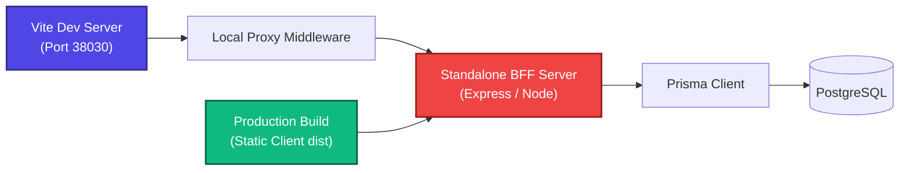

# ADR-003: BFF/Express Architecture vs Vite Middleware

*   **Status:** Accepted
*   **Scope:** Runtime & Production Deployment
*   **Author:** Antigravity (AI Architect)
*   **Date:** 2026-05-24

---

## Context

To run dynamic PostgreSQL and Prisma database queries in our development sandbox, we integrated a custom plugin inside `vite.config.ts` utilizing Vite's Express-compatible `configureServer` middleware hook.

While this is highly performant and eliminates CORS issues during development, it has severe production limitations:
1.  **Vite Dev Server is Dev-Only**: In production builds (`vite build` -> static HTML/JS), the Vite development server is entirely bypassed. Standard static deployments (like Vercel, Firebase classic Hosting, or standard CDN buckets) cannot run Node.js database middleware.
2.  **No Serverless/Docker Portability**: The database logic is tightly coupled to Vite's server runtime config, preventing deployment in standard container environments (like Docker production orchestration or PM2 clusters) or Vercel edge/serverless functions.

---

## Proposed Decision

We decide to decouple the API routes from Vite configuration and establish a dedicated, production-portable **Backend-For-Frontend (BFF)** Express API Layer.



### Implementation Steps

1.  **Extract Middleware Logic**: Extract all Prisma v7 PostgreSQL query functions from `src/utils/viteApiMiddleware.ts` into a self-contained, standalone backend directory `/backend/src/` (e.g., `/backend/src/controllers/universityController.ts`).
2.  **BFF Express Entrypoint**: Create a production-ready standalone backend server (e.g. `/backend/server.ts`) running a standalone Express process.
3.  **Vite Dev Proxy Integration**: In `vite.config.ts`, replace the custom plugin middleware handler with a simple, standard Vite proxy routing configuration:
    ```typescript
    server: {
      proxy: {
        '/api': {
          target: 'http://localhost:38080', // Standalone BFF local port
          changeOrigin: true
        }
      }
    }
    ```
4.  **Flexible Deployment Modes**:
    *   *Development*: Standard `npm run dev` spawns both Vite and the local BFF concurrently using `concurrently` or a single unified orchestrator.
    *   *Production*: Compile frontend to `dist/`, build `/backend/server.ts` to `dist-server/`, and serve static assets securely through Express static middlewares.

---

## Consequences

*   **Production Portability**: The backend can be containerized, scaled, and deployed flawlessly to standard platforms (Docker, Vercel, PM2, or Firebase App Hosting).
*   **Separation of Concerns**: Decouples Vite (build and asset bundler tool) from the API business logic, resolving future bundler compilation bugs.
*   **Enhanced Security boundaries**: Enables simple backend environment config segregation, logging, rate limiting, and CORS protection.
