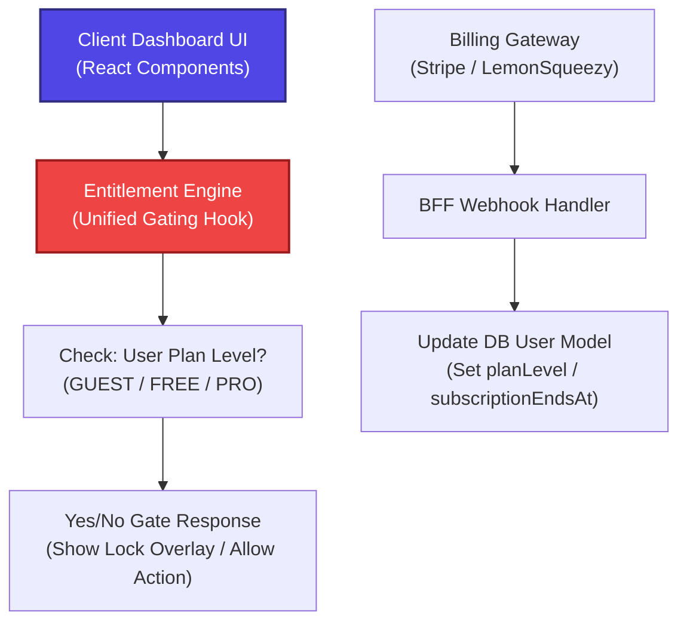

# ADR-004: SaaS Entitlement Gating before Billing Integration

*   **Status:** Accepted
*   **Scope:** SaaS Architecture & Product Roadmap
*   **Author:** Antigravity (AI Architect)
*   **Date:** 2026-05-24

---

## Context

The roadmap demands integrating SaaS monetization (paid tiers, premium locks, custom comparison quotas, search limitations). Standard practice is to write billing gateway code (e.g. Stripe checkout links, Stripe webhooks, or LemonSqueezy checkouts) directly into the UI components.

However, this creates severe architectural issues:
1.  **Tight Coupling**: UI components become locked to a specific payment provider's terminology (e.g., Stripe Price IDs).
2.  **Untestable Workflows**: Mocking payment flows for E2E tests becomes extremely difficult, blocking automated integration validation.
3.  **Business Logic Duplication**: Client-side gates can be bypassed easily if BFF backend endpoints do not execute matching validation checks.

---

## Proposed Decision

We decide to build a strict, standalone **Entitlement Engine** that completely decouples product monetization gating from specific billing gateway SDKs.



### Architectural Specifications

1.  **User Schema Fields**: The database `User` model holds clear, provider-agnostic monetization markers:
    *   `role`: `'GUEST' | 'FREE' | 'PRO' | 'ADMIN'`
    *   `subscriptionStatus`: `'active' | 'trialing' | 'canceled' | 'none'`
    *   `subscriptionEndsAt`: `DateTime?`
2.  **Entitlement Gates (Unified Client-Side Gating Hooks)**: Create a unified react hook `useEntitlements()` that maps plans to specific permission flags:
    ```typescript
    export interface Entitlements {
      canViewRadarChart: boolean;
      canCreatePrerequisiteLinks: boolean;
      maxBookmarksCount: number;
      showPremiumAdBlockers: boolean;
    }
    ```
    UI components check entitlements (e.g., `entitlements.canViewRadarChart`), never Stripe plan IDs.
3.  **BFF Server-Side Enforcement Middleware**: Corresponding BFF Express API controllers MUST execute matching entitlement checks before returning dynamic query details (such as standard earnings ranges or comparative rankings).
4.  **Decoupled Webhooks**: The billing integration is strictly limited to a single Express webhook controller that receives provider events, maps them to provider-agnostic database fields, and updates the local user database.

---

## Consequences

*   **100% Provider Agnostic**: Switching from Stripe to LemonSqueezy, Paddle, or custom enterprise corporate accounts requires zero UI refactoring; only the server-side webhook mapper changes.
*   **100% Testable**: Automated integration tests can instantly mock premium access by simply toggling the mock user database `role = 'PRO'`, allowing robust E2E test scripts.
*   **Robust Security Gating**: Prevents clients from bypassing restrictions since security checks are enforced uniformly on both client-side and backend BFF layers.
