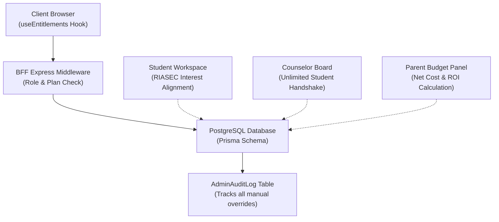

# ADR-006: Role-Based User Workspaces, Paywall Gating, and Collaborative Sharing

*   **Status:** Proposed (需要商榷)
*   **Scope:** SaaS Architecture & Security Boundary
*   **Author:** Antigravity (AI Architect)
*   **Date:** 2026-05-24

> [!NOTE]
> 本篇架构决策记录目前处于 **需要商榷** 状态，其具体的商业化权益分配边界、角色定制逻辑及数据脱敏细节，需在开发前与业务团队进行进一步审议和微调。

---

## Context

Our application is evolving from a static-dynamic blended college major search tool into a commercial, multi-role academic ROI matchmaker. To support different types of users (students, parents, teachers, and counselors) with localized, context-aware information while introducing strict paywall gating and auditable data validation, we need a robust, cohesive user management and collaboration architecture. 

Writing ad-hoc role-routing logic and unstructured shareability features creates key architectural concerns:
1.  **Privilege Escalation Risk**: If dynamic endpoints do not validate both client-side and backend permissions (especially around student GPA or budget figures), sensitive PII could leak.
2.  **SaaS Friction**: Aggressive paywalls can alienate users. We need an "Advisor Sponsorship" model that allows paid advisors to share access without giving away full-platform PRO credentials.
3.  **Auditing Failure**: Admin manual changes to data mappings (such as `isValidated` overrides) must maintain high accountability to preserve data authenticity guidelines.

---

## Proposed Decision

We decide to build a unified **Role-Based Workspace and Collaborative Sharing Framework** fully integrated into our Express BFF, dynamic Prisma schema, and React frontends.



### 1. Data Schema Enhancements

We will extend the Prisma schema with an explicit relationship for student-counselor tracking, custom budget data points, and a comprehensive database-wide administrative auditing model.

```prisma
// Expanded User Model and new Auditing Models
model User {
  id                 String               @id @default(uuid())
  email              String               @unique
  name               String?
  role               String               @default("FREE") // 'GUEST' | 'FREE' | 'PRO' | 'ADMIN'
  userType           String               @default("STUDENT") // 'STUDENT' | 'TEACHER' | 'COUNSELOR' | 'PARENT' | 'OTHER'
  schoolName         String?
  gradYear           Int?
  counselorSpecialty String?
  teacherSubject     String?
  customNote         String?
  subscriptionStatus String               @default("none") // 'active' | 'trialing' | 'canceled' | 'none'
  subscriptionEndsAt DateTime?
  createdAt          DateTime             @default(now())
  updatedAt          DateTime             @updatedAt
  
  // Relations
  savedItems         SavedItem[]
  collaborations     BoardCollaboration[]
  adminLogs          AdminAuditLog[]
}

model BoardCollaboration {
  id           String    @id @default(uuid())
  boardName    String
  ownerId      String    // The Counselor or Parent who created the board
  studentId    String    // The Student whose list is being reviewed
  status       String    @default("PENDING") // 'PENDING' | 'ACCEPTED' | 'REVOKED'
  createdAt    DateTime  @default(now())
  updatedAt    DateTime  @updatedAt

  @@unique([ownerId, studentId])
}

model AdminAuditLog {
  id        String   @id @default(uuid())
  adminId   String   // Operating administrator's User.id
  admin     User     @relation(fields: [adminId], references: [id], onDelete: Restrict)
  action    String   // e.g. 'VALIDATE_MAJOR_MAPPING', 'VERIFY_RANKING_LINEAGE'
  target    String   // Model class: 'UniversityMajorAssociation', 'MajorCipMapping'
  targetId  String   // Target primary key UUID
  changes   Json     // Audit diff: { before: {...}, after: {...} }
  createdAt DateTime @default(now())
}
```

### 2. Gating and Entitlement Specifications

Our BFF middleware and `useEntitlements()` React hook will enforce the following commercial paywall thresholds:

1.  **Search Gating**:
    *   `FREE` Users: Query results are restricted at the database layer (via Prisma queries) to the **Top 10 highest-paying majors** and the **Top 10 ranked universities**. Non-matching records return placeholder values or blocked structures.
    *   `PRO` & `ADMIN` Users: Return all 152 standard majors and full global university records.
2.  **Saves & Comparisons**:
    *   `FREE` Users: Max bookmarks count capped at 8 (`maxBookmarksCount: 8`). Universities compared in the bento view capped at 2.
    *   `PRO` Users: Unlimited bookmarks, up to 5 universities compared side-by-side.
3.  **Client Association (B2B Counselor Limits)**:
    *   `FREE` Counselors: Capped at 3 associated student handshakes.
    *   `COUNSELOR_PRO` / Enterprise: Unlimited student connections, unlocking automated CSV/JSON exports.

### 3. Shareability & Tri-Party Collaboration

*   **Advisor Sponsorship**: When a paid `COUNSELOR_PRO` creates a collaborative shared board, their premium search entitlements are shared with the connected `FREE` student **only within the scope of that board**. 
*   **Tri-Party Interface Integration**: A unified React view renders role-tailored panels:
    *   *Student View*: RIASEC interest scores and major prerequisite checkpoints.
    *   *Parent View*: Tuition budget matching and Net Cost Calculator showing expected debt-to-earnings ratio.
    *   *Counselor View*: Custom guidance notes and target admissions deadlines.
*   **Optimistic Polling**: The frontend uses SWR or React Query caching with local optimistic writes for student/counselor annotations, reducing overhead and removing complex socket dependencies.

### 4. Privacy & Auditing Compliance

*   **Consent Handshake**: Connected students must explicitly accept Counselor board invites via a secure dashboard alert before counselor notes can be written or student selections reviewed. Access can be unilaterally revoked by the student at any time.
*   **Anonymized PII Exports**: PDF/JSON export dialogs feature a mandatory PII scrubbing toggle. When selected, student names, grades, and household budget bounds are replaced with generalized references (e.g., *"Student Alpha"*).
*   **Tamper-Evident Admin Logging**: Every manual audit change to static-blended datasets (like QS global ranks or standard CIP mapping validations) must insert a log entry into `AdminAuditLog` detailing the operator, entity type, and value diff.

---

## Consequences

*   **Commercial Viability**: Locks down high-value data assets (full university matching list and prerequisite pathways) while giving free users an immediate incentive to upgrade.
*   **High Trust & Privacy**: Minimizes institutional compliance friction (GDPR/FERPA-aligned design patterns) through the student consent handshake and anonymized exports.
*   **Strict Audit Trails**: Ensures changes made by administrators to mapping schemas are tracked, maintaining data lineage and eliminating undocumented edits.
