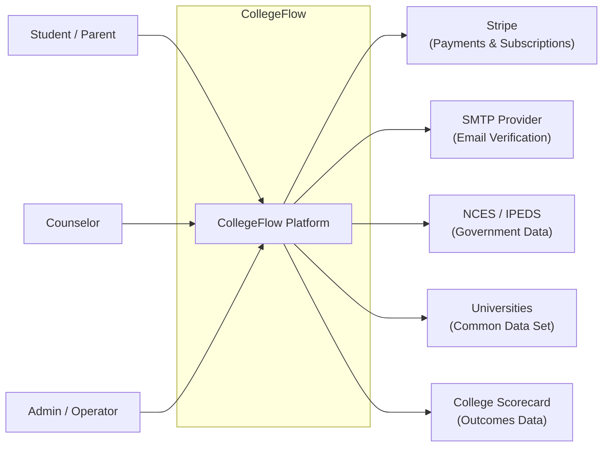
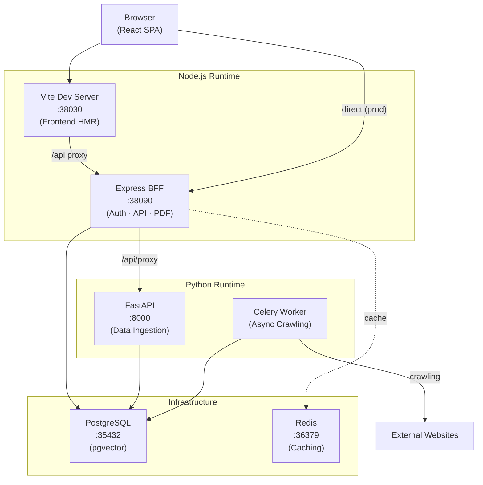

# 01 — System Overview

> C4 architecture map for CollegeFlow. Read this first to understand what the system is.

## C4 Level 1 — System Context

CollegeFlow is a **college decision intelligence platform** that helps students, parents, and counselors compare US universities using verified data (IPEDS, CDS, College Scorecard) and generate actionable comparison reports.

## C4 Level 2 — Containers

### Container Responsibilities

| Container | Port | Technology | Owns | Does NOT Own |
|-----------|------|------------|------|--------------|
| **React SPA** | 38030 | Vite + React 19 + Tailwind | UI rendering, client routing, entitlement UI | Business logic, data storage, auth secrets |
| **Express BFF** | 38090 | Express + Better Auth + Prisma | Auth sessions, API routes, entitlement enforcement, PDF generation, Stripe webhooks | Data ingestion, web scraping, ML model training |
| **FastAPI Pipeline** | 8000 | FastAPI + Scrapy + Celery | Data ingestion, web crawling, curriculum parsing, IPEDS ETL | User management, API serving, auth |
| **PostgreSQL** | 35432 | PostgreSQL 16 + pgvector | All persistent data: users, universities, metrics, comparisons | Session caching, transient data |
| **Redis** | 36379 | Redis | Better Auth sessions, comparison cache | Persistent data, relational queries |

### Communication Paths

| From | To | Protocol | Purpose |
|------|-----|----------|---------|
| Browser | Vite | HTTP | Static assets, HMR (dev only) |
| Browser | BFF | HTTP + Cookies | Auth, API calls, PDF downloads |
| Vite | BFF | HTTP Proxy | `/api/*` → `localhost:38090` (dev only) |
| BFF | FastAPI | HTTP Proxy | `/api/proxy/*` → `localhost:8000` |
| BFF | PostgreSQL | TCP (Prisma PG adapter) | All data operations |
| FastAPI | PostgreSQL | TCP (psycopg2) | Data ingestion, raw table writes |
| Celery | PostgreSQL | TCP | Task results, crawl data |
| BFF | Redis | TCP | Session storage, caching |

### Key Files

| File | Purpose |
|------|---------|
| `vite.config.ts` | Vite config, API proxy to BFF |
| `server/server.ts` | Express BFF: all routes, auth, middleware (~2300 lines) |
| `prisma/schema.prisma` | Complete data model (25+ models) |
| `docker-compose.yml` | Infrastructure: PostgreSQL + Redis |
| `backend/main.py` | FastAPI entry point |
| `backend/celery_app.py` | Celery worker config |
| `.env` | Environment variables (see [06-deployment.md](06-deployment.md)) |

### Related ADRs

- [ADR-001](../adr/ADR-001-postgresql-source-of-truth.md) — PostgreSQL as Business Source of Truth
- [ADR-003](../adr/ADR-003-vite-middleware-vs-reusable-bff.md) — BFF/Express Architecture
- [ADR-005](../adr/ADR-005-ipeds-raw-mirror-and-product-projection.md) — IPEDS Raw Mirror And Product Projection
