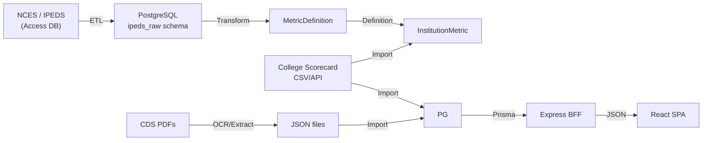

# 03 — Data Architecture

> How data is organized, flows through the system, and which models belong to which domain.

## Data Model Domains

The 25+ Prisma models are grouped into 4 domains:

### Identity Domain — Users, Access, Billing

```
User ────┬─── SavedItem
         ├─── SubscriptionHistory
         └─── StudentWorkspace ──┬─── DecisionProfile ── ProfileWeight
                                 ├─── ComparisonSession ── ComparisonOption
                                 ├─── CounselorNote
                                 └─── ReportGeneration
```

| Model | Purpose | Key Fields |
|-------|---------|------------|
| `User` | Authentication + entitlements | `id`, `email`, `role`, `userType`, `subscriptionStatus` |
| `SavedItem` | User bookmarks for majors/universities | `userId`, `itemType`, `itemId` |
| `SubscriptionHistory` | Audit trail for subscription changes | `userId`, `field`, `oldValue`, `newValue`, `changedBy` |
| `StudentWorkspace` | Counselor-student relationship | `counselorId`, `studentId`, `inviteToken`, `inviteAccepted` |
| `DecisionProfile` | Student's academic/budget profile | `gpa`, `satScore`, `annualBudgetMin/Max`, `interestAreas` |
| `ProfileWeight` | Decision preference weights | `salaryWeight`, `prestigeWeight`, `costWeight`, `fitWeight` |
| `ComparisonSession` | Named comparison group | `workspaceId`, `name` |
| `ComparisonOption` | University in a comparison | `sessionId`, `universityId`, `majorId` |
| `CounselorNote` | Counselor notes on student | `workspaceId`, `counselorId`, `noteType`, `content` |
| `ReportGeneration` | Generated PDF reports | `sessionId`, `generatedBy`, `pdfUrl` |

### Data Asset Domain — Universities, Majors, Rankings

```
BroadField ─── Major ─── MajorCipMapping ─── CipCode
                  │
DetailedField ───┘
                  │
University ─── School ─── UniversityMajorAssociation
     │
     ├─── UniversityRankingLineage
     ├─── UniversityExternalIdentifier
     ├─── MajorRanking
     ├─── InstitutionMetric ─── MetricDefinition
     ├─── InstitutionProgramField
     ├─── InstitutionCandidate
     └─── InstitutionPublishDecision
```

| Model | Purpose | Key Fields |
|-------|---------|------------|
| `University` | Institution identity | `id`, `nameEn`, `scorecardUnitId`, `rankingQs`, `rankingUsNews` |
| `School` | College/department within university | `universityId`, `nameEn` |
| `UniversityMajorAssociation` | University-specific program mapping | `universityId`, `customName`, `standardMajorId`, `degreeLevel` |
| `Major` | Standard major taxonomy | `id`, `nameEn`, `broadFieldId`, `detailedFieldId` |
| `BroadField` | Top-level field (STEM, Business, etc.) | `id`, `nameEn`, `nameZh`, earnings data |
| `DetailedField` | Mid-level field within broad field | `id`, `broadFieldId`, earnings, unemployment data |
| `MajorRanking` | Subject rankings (e.g. CS) | `universityId`, `standardMajorId`, `rankInteger`, `source` |
| `UniversityRankingLineage` | Historical rankings | `universityId`, `rankInteger`, `year`, `source` |
| `UniversityExternalIdentifier` | Cross-reference IDs | `universityId`, `identifierType`, `identifierValue` |
| `CipCode` | CIP code taxonomy | `code`, `title`, `version`, `level` |
| `MajorCipMapping` | Major → CIP code mapping | `majorId`, `cipCode`, `mappingScore`, `status` |

### IPEDS Domain — Government Data + Provenance

| Model | Purpose | Key Fields |
|-------|---------|------------|
| `MetricDefinition` | Metric registry with labels and policies | `metricKey`, `labelEn`, `valueType`, `missingValuePolicy` |
| `InstitutionMetric` | Actual metric values per institution | `metricKey`, `universityId`, `valueNumeric`, `valueStatus` |
| `InstitutionProgramField` | IPEDS program enrollment/completion data | `universityId`, `cipCode`, `degreeLevel`, `completionsTotal` |
| `InstitutionCandidate` | Institution inclusion candidate | `unitId`, `eligibilityScore`, `recommendation`, `blockingReasons` |
| `InstitutionPublishDecision` | Publish/hide decision | `candidateId`, `status`, `decidedBy` |

### User Data Flow



## Role vs UserType — Resolved

Two fields on `User` often cause confusion. Here is the resolution:

| Field | Purpose | Values | Changes |
|-------|---------|--------|---------|
| `userType` | **Who am I?** (persona) | `STUDENT`, `COUNSELOR`, `PARENT`, `TEACHER`, `OTHER` | Set during onboarding, rarely changes |
| `role` | **What am I allowed to do?** (entitlement tier) | `GUEST`, `FREE`, `PRO`, `COUNSELOR`, `ADMIN` | Changes via subscription or admin action |

### Decision Matrix

```
userType = COUNSELOR + role = COUNSELOR  → Full counselor CRM (invite students, notes, reports)
userType = STUDENT  + role = FREE        → Limited features (1 comparison, no PDF)
userType = STUDENT  + role = PRO         → All features (unlimited comparisons, PDF)
userType = STUDENT  + role = GUEST       → Browse only, no saved items
role     = ADMIN                         → Full admin console, all routes
```

### Why Both Fields?

- `userType` controls **UI flows and route access** (e.g. `/dashboard/counselor` only for COUNSELOR userType)
- `role` controls **feature entitlements** (e.g. `maxComparisons`, `canGenerateReports`)

In the future, these could be unified into a single concept, but for now the separation is intentional and necessary.

## Static vs Dynamic Data

| Data | Source | Frequency | Storage |
|------|--------|-----------|---------|
| Taxonomy (Broad/Detailed Fields, Majors) | Seed file | Once | Prisma seed |
| University identities | Seed + manual | Rarely | Database |
| Rankings | Seed + manual | Yearly | Database |
| IPEDS metrics | Python ETL pipeline | Yearly | Database |
| CDS data | OCR + import | Yearly | Database |
| User accounts | Better Auth registration | Real-time | Database |
| Workspaces, profiles, comparisons | User actions | Real-time | Database |

## Related ADRs

- [ADR-001](../adr/ADR-001-postgresql-source-of-truth.md) — PostgreSQL as Business Source of Truth
- [ADR-002](../adr/ADR-002-ranking-lineage-model.md) — University Ranking Lineage & Audit Provenance
- [ADR-005](../adr/ADR-005-ipeds-raw-mirror-and-product-projection.md) — IPEDS Raw Mirror And Product Projection
- [ADR-006](../adr/ADR-006-role-based-user-management-and-collaborative-sharing.md) — Role-Based User Workspaces
