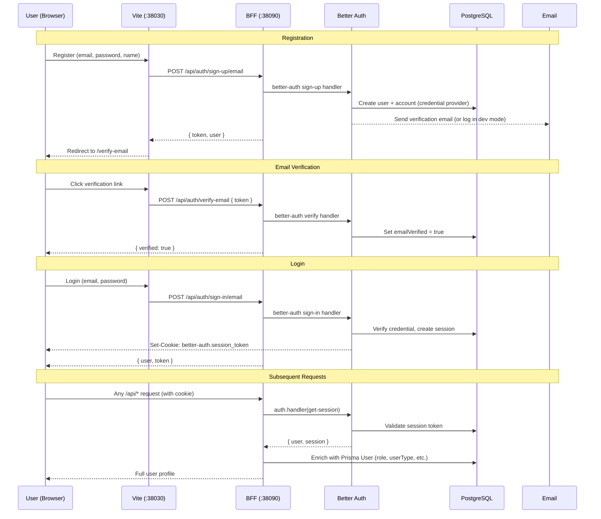

# 04 — Auth & Security Architecture

> How authentication, sessions, and entitlements work end-to-end.

## Auth Flow



## Better Auth Configuration

Better Auth is configured in `server/server.ts` with:

| Setting | Value | Purpose |
|---------|-------|---------|
| `database` | `pg.Pool` (raw connection) | Direct PG access for auth tables |
| `user.modelName` | `"User"` | **Unified**: uses Prisma's User table directly |
| `user.fields.emailVerified` | `"emailVerified"` | Maps to Prisma field |
| `emailAndPassword.enabled` | `true` | Email + password auth |
| `emailAndPassword.requireEmailVerification` | `false` (dev) / `true` (prod) | Auto-verify in dev mode |
| `session.cookieCache.enabled` | `true` | 5-minute in-memory cache |
| `session.cookieCache.maxAge` | 300 (5 minutes) | Cache TTL |

### Unified User Model

After the recent refactor, Better Auth writes directly to the Prisma `User` table (not a separate `"user"` table). This eliminates the need for `syncAppUserFromAuthUser()`.

The tables that Better Auth manages separately are:

| Table | Purpose |
|-------|---------|
| `account` | Credential storage (providerId, accountId, password hash) |
| `session` | Active sessions (token, userId, expiresAt) |
| `verification` | Email verification tokens |

## Session Lifecycle

1. **Login** → Better Auth creates a session record, returns `Set-Cookie: better-auth.session_token=<token>`
2. **Cookie** → HTTP-only, secure, sent automatically by browser on subsequent requests
3. **Verification** → BFF calls `auth.handler(new Request(baseUrl + '/api/auth/get-session'))` — the **self-proxy pattern**
4. **Enrichment** → Session returns basic user info from Better Auth; BFF enriches with Prisma User data
5. **Cache** → 5-minute in-memory cache reduces DB hits for session lookups
6. **Logout** → POST `/api/auth/sign-out` invalidates session

### Self-Proxy Pattern Risk

The BFF calls itself via HTTP to validate sessions:

```typescript
const sessionRes = await auth.handler(
  new Request(`${baseUrl}/api/auth/get-session`, { headers: requestHeaders })
);
```

This is fragile because:
- `baseUrl` must be correct (configured via `BETTER_AUTH_URL`)
- If `baseUrl` is wrong, all auth checks fail silently
- **Future improvement**: use `auth.api.getSession()` directly instead of HTTP call

## Entitlement Architecture

### Current State: Client-Side Only

Entitlements are computed **entirely on the frontend** via `useEntitlements.ts`:

```
role: GUEST     → maxComparisons: 0,   canGenerateReports: false
role: FREE      → maxComparisons: 1,   canGenerateReports: false
role: PRO       → maxComparisons: 999, canGenerateReports: true
role: COUNSELOR → maxComparisons: 999, canGenerateReports: true
role: ADMIN     → maxComparisons: 999, canGenerateReports: true
```

Backend middleware exists for **role checks** but not **entitlement checks**:

| Middleware | Checks | Routes Protected |
|------------|--------|-----------------|
| `requireSession` | Has valid session | Most MVP routes |
| `requireAdmin` | `role === 'ADMIN'` | All `/api/admin/*` routes |
| `requireCounselor` | `userType === 'COUNSELOR'` | `/api/counselor/*` routes |
| `requireStudent` | `userType === 'STUDENT'` | `/api/student/*` routes |

### Gap: No Backend Entitlement Enforcement

The `/api/comparison` endpoint does check FREE tier limits internally, but there is no general entitlement middleware. Per [ADR-004](../adr/ADR-004-saas-entitlement-boundary.md), entitlement enforcement must happen at the backend before any billing integration.

### Target State

```
Client → BFF → [Auth Middleware] → [Entitlement Middleware] → Route Handler
                              ↑                        ↑
                        Is user logged in?       Has feature access?
```

## Route Access Matrix

| Route Pattern | Requires Session | Requires userType | Requires role | Entitlement Check |
|---------------|-----------------|-------------------|---------------|-------------------|
| `/api/auth/*` (except me) | No | — | — | No |
| `/api/auth/me` | Yes | — | — | No |
| `/api/universities` | No | — | — | No (public) |
| `/api/ipeds/university/*` | No | — | — | No (public) |
| `/api/users/me` | Yes | — | — | No |
| `/api/users/me/saved-items` | Yes | — | — | No (FREE tier limit implicit) |
| `/api/admin/*` | Yes | — | ADMIN | No |
| `/api/admin/ipeds/*` | Yes | — | ADMIN | No |
| `/api/counselor/invite` | Yes | COUNSELOR | — | No |
| `/api/counselor/students` | Yes | COUNSELOR | — | No |
| `/api/counselor/note/*` | Yes | COUNSELOR | — | No |
| `/api/student/invite/:token` | No (GET) / Yes (POST) | — | — | No |
| `/api/student/profile` | Yes | STUDENT | — | No |
| `/api/comparison` (POST) | Yes | — | — | Yes (FREE tier: max 1) |
| `/api/comparison/:id` (GET) | Yes | — | — | No |
| `/api/report/generate` | Yes | — | — | Yes (PRO/COUNSELOR only) |

## Security Boundaries

### What is Protected
- Auth routes use Better Auth session validation
- Admin routes gated by `requireAdmin`
- Counselor routes gated by `requireCounselor`
- Student routes gated by `requireStudent`

### What is NOT Yet Protected
- Entitlement enforcement is client-side (FREE users can bypass UI limits)
- Workspace ownership checks are partial (comparison checks workspace, but not all routes)
- No rate limiting
- No CORS configuration beyond Better Auth `trustedOrigins`

## Related ADRs

- [ADR-004](../adr/ADR-004-saas-entitlement-boundary.md) — SaaS Entitlement Gating
- [ADR-006](../adr/ADR-006-role-based-user-management-and-collaborative-sharing.md) — Role-Based User Workspaces
