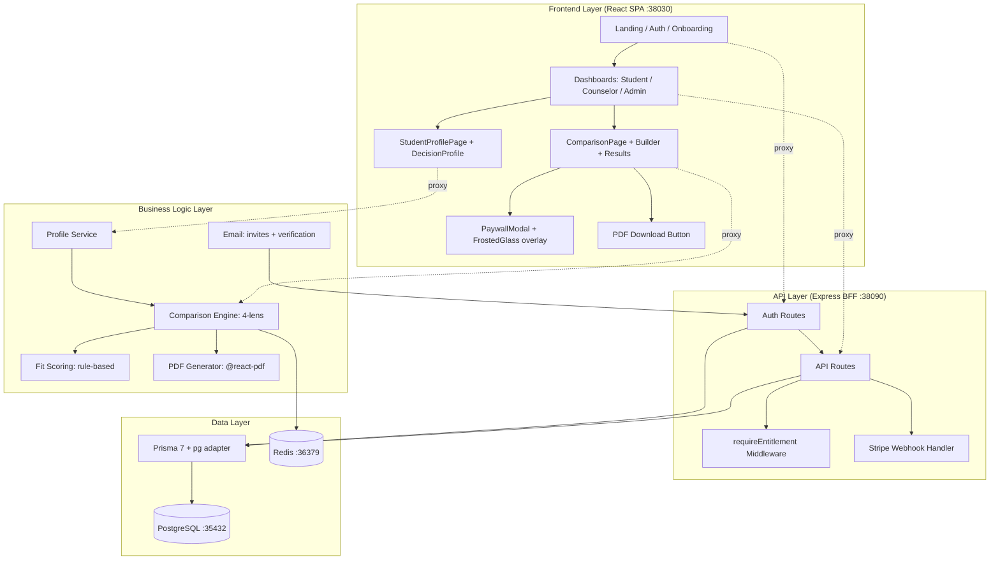
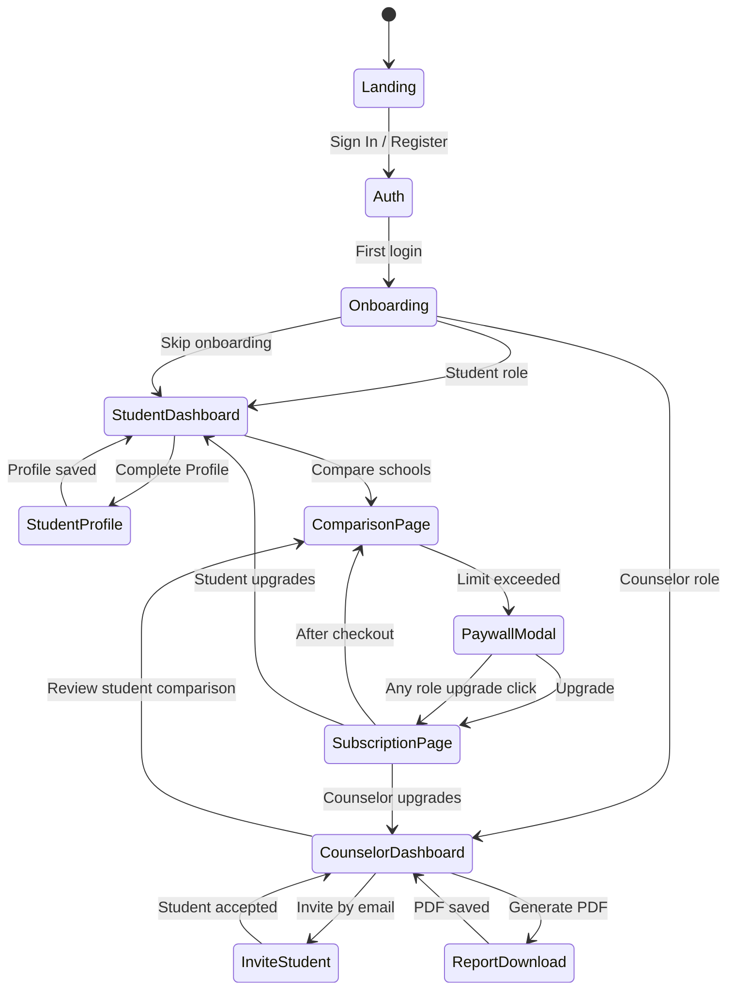

# CollegeFlow MVP v1 — Implementation Plan

**Date**: 2026-05-28
**Branch**: `feat/mvp-core-implementation`
**Status**: Core backend + frontend scaffolding complete; gap-closure phase

---

## Goal

Ship a counselor-invited student workspace where a counselor invites 1-5 students, each student completes a basic profile, and the counselor can generate a 4-lens comparison report (Admissions, Outcomes, Cost, Fit) as a branded PDF for family meetings. All 15 MVP Must-Have features have partial implementations; this plan closes the remaining gaps to reach shippable quality.

**Success criteria** (from MVP-SCOPE.md):
- 3 counselors invite ≥2 students each
- 6 family meeting reports generated in first 30 days
- 1 family upgrades to Pro ($19)
- Time-to-value: onboarding → first comparison in <5 minutes

---

## Current State Assessment

### Implemented (✅ Ready)
| Feature | PRD | Backend | Frontend | Notes |
|---------|-----|---------|----------|-------|
| User auth | PRD-001 | ✅ Better Auth + Prisma | ✅ Login/Register/Verify | Email verification, password reset all working |
| Decision Profile | PRD-200 | ✅ Profile + Weights models | ✅ StudentProfilePage (3-step) | GPA, SAT, budget, interests captured |
| Institution Identity | PRD-110 | ✅ University + IPEDS models | ✅ UniversityNavigator | IPEDS-linked institution data |
| Major CIP Mapping | PRD-131 | ✅ CipCode + MajorCipMapping | ✅ MajorsDirectory (152 majors) | CIP-aligned standard majors |
| Program Catalogs | PRD-130 | ✅ School + Major models | ✅ UniversityNavigator | Top 50 US program data |
| Scorecard Outcomes | PRD-111 | ✅ IPEDS metrics | ✅ CompareModal, ComparisonPage | Earnings, growth, unemployment |
| CDS Data | PRD-112 | ✅ IPEDS acceptance/cost metrics | ✅ University data models | Admissions rates, costs, enrollment |
| Comparison (4-lens) | PRD-206 | ✅ ComparisonSession + engine | ✅ ComparisonPage (builder + results) | Admissions/Outcomes/Cost/Fit |
| Fit Engine (basic) | PRD-201 | ✅ Rule-based scoring | ✅ matchingHelper.ts | Jaro-Winkler similarity |
| Confidence Score | PRD-203 | ✅ Verified/Stale/Missing states | ✅ ConfidenceBadge | Per-data-point confidence |
| Data Gap Warnings | PRD-204 | ✅ Missing reason field | ✅ Data gap indicators | Missing/stale states shown |
| Counselor CRM | PRD-400 | ✅ Invite + students + notes API | ✅ CounselorDashboardPage | Email invites, student tracking |
| Reports (PDF) | PRD-402 | ✅ @react-pdf/renderer | ✅ PDF button in ComparisonPage | PRO-gated, branded PDF |
| Entitlement Model | PRD-500 | ✅ requireEntitlement middleware | ✅ useEntitlements hook | Guest/Free/Pro/Counselor/Admin |
| Landing Page | — | — | ✅ LandingPage.tsx | Hero, features, pricing modal |

### Partial / Gaps (⚠️ Needs Work)
| Feature | PRD | Gap | Severity |
|---------|-----|-----|----------|
| Paywall / Teaser Gating | PRD-501 | No frosted-glass content masking, no role-aware messaging, no "Ask Parent to Unlock" pathway | High |
| Workspace Boundary | PRD-506 | Comparison limit (1 free) enforced, but **student count limits per counselor tier NOT enforced** | High |
| SaaS Packages Pricing | PRD-503 | Free/Pro/Counselor prices exist, but Starter/Professional/Agency tier structure missing | Medium |
| Onboarding Wizard | PRD-300 | 3-step flow exists but missing "Skip for Now", weight allocation sliders, First Insight Card | Medium |
| Data Authenticity UI | PRD-002 | Confidence badges render but **source verification codes (IPEDS/USN) not displayed** in comparison results | Low |

---

## Requirements

### Functional Requirements

1. **FR-001**: Free tier users see partial data with frosted-glass masking on premium features (ROI charts, prerequisite flows, comparison beyond 1 session)
2. **FR-002**: Counselor tiers enforce student count limits (Free/Starter: 3, Professional: 50, Agency: 200)
3. **FR-003**: Onboarding wizard includes "Skip for Now" option and completes with a First Insight Card
4. **FR-004**: Comparison results display source verification codes (e.g., `IPEDS-123456`) alongside data points
5. **FR-005**: Landing page pricing section reflects actual Free/Pro/Counselor tiers with correct feature lists
6. **FR-006**: Student users see "Ask Parent to Unlock" pathway when encountering paywall
7. **FR-007**: Counselor invite flow enforces tier-based student limits with clear upgrade messaging

### Non-Functional Requirements

1. **NFR-001**: Time-to-value <5 minutes (onboarding → first comparison)
2. **NFR-002**: All API endpoints return proper error codes for entitlement violations
3. **NFR-003**: PDF report renders within 5 seconds for 4-university comparison
4. **NFR-004**: Data authenticity: no fabricated data; all stats trace to verifiable sources

---

## Technical Considerations

### System Architecture Overview



**Layers unchanged from current architecture.** New additions are:
- `PaywallModal` + `FrostedGlass` frontend components
- Backend student-limit enforcement in counselor invite endpoint
- Source verification code rendering in comparison results

### Technology Stack Selection

| Layer | Technology | Rationale |
|-------|-----------|-----------|
| Frontend | React 19 + Vite + Tailwind + shadcn/ui | Already in use, component library established |
| State | useSession + useEntitlements (custom hooks) | Simple, no need for Zustand/Redux at this scale |
| BFF | Express + Better Auth + Prisma 7 | Auth, API, entitlements unified |
| Database | PostgreSQL 16 + pgvector | 25+ models across 4 domains |
| Cache | Redis | Sessions, comparison cache |
| PDF | @react-pdf/renderer | Server-side PDF generation |
| Payments | Stripe Checkout + Billing Portal | Subscription lifecycle |
| Email | Nodemailer | Verification + invites |

### Integration Points

- **Frontend ↔ BFF**: Vite proxies `/api` to `:38090`. All API calls use `/api/*` prefix.
- **BFF ↔ PostgreSQL**: Prisma 7 with `@prisma/adapter-pg` + `pg.Pool`.
- **BFF ↔ Stripe**: Stripe Node SDK, webhook at `/api/stripe/webhook`.
- **BFF ↔ Email**: Nodemailer transporter, dev mode logs to console.
- **BFF ↔ FastAPI**: `/api/proxy/*` routes proxy to Python data pipeline `:8000`.

### Scalability Considerations

- **v1 scope**: Single BFF instance, single PostgreSQL, single Redis. No horizontal scaling needed until >100 concurrent users.
- **Future**: Comparison results are cacheable in Redis for 5 minutes; PDF generation can be offloaded to a background queue.

---

## Database Schema Design

### Existing Models (No Changes Needed)

The current Prisma schema covers all MVP data domains. No new models are required.

### Schema Changes Required

**1. StudentWorkspace** — Add `maxStudents` field for tier enforcement:

```prisma
model StudentWorkspace {
  // ... existing fields ...
  maxStudents   Int     @default(3)  // 3 for Free/Starter, 50 for Pro, 200 for Agency
}
```

**2. User** — Ensure `maxStudents` is derivable from role (no schema change, add helper):

| Role | maxStudents |
|------|-------------|
| GUEST | 0 |
| FREE | 3 (as counselor starter) |
| PRO | unlimited |
| COUNSELOR | 50 |
| ADMIN | unlimited |

### Indexing Strategy

- `StudentWorkspace(counselorId)` — already indexed for counselor dashboard queries
- `User(role)` — consider adding index if admin user list queries become slow
- No new indexes needed for MVP gaps

### Migration Strategy

1. `npx prisma migrate dev --name add_max_students_to_workspace`
2. Regenerate Prisma Client: `npx prisma generate`
3. Seed: set `maxStudents = 3` for existing FREE-tier counselor workspaces

---

## API Design

### New / Modified Endpoints

#### 1. Enforce Student Limit on Invite

**Modify**: `POST /api/counselor/invite`

**Current behavior**: Invites student without checking counselor's student count.

**New behavior**:
```typescript
// Pseudocode
const counselor = await getUserByEmail(session.user.email)
const currentStudentCount = await prisma.studentWorkspace.count({
  where: { counselorId: counselor.id }
})
const maxStudents = getMaxStudentsForRole(counselor.role)

if (currentStudentCount >= maxStudents) {
  return res.status(403).json({
    error: 'STUDENT_LIMIT_EXCEEDED',
    current: currentStudentCount,
    limit: maxStudents,
    upgradeTo: 'COUNSELOR'
  })
}
// ... proceed with invite
```

**Response changes**:
- `403 STUDENT_LIMIT_EXCEEDED` — new error code with current/limit/upgradeTo fields

#### 2. Frosted Glass: Comparison Content Masking

**No new endpoints.** The comparison engine already returns full data. Frosted glass is implemented **frontend-only** for UX (teaser gating). The comparison count limit is already enforced at `POST /api/comparison`.

**Rationale**: For MVP, free-tier users can see comparison results but only 1 session. Full data is visible. Frosted glass applies to **ROI charts** and **prerequisite flows** on the frontend only. Backend enforcement for content masking is deferred to v1.1.

#### 3. Workspace Limit Info Endpoint (New)

**New**: `GET /api/counselor/workspace/limits`

Returns counselor's current student count vs limit.

```typescript
// Response
{
  currentStudents: number,
  maxStudents: number,
  tier: string,
  canInviteMore: boolean
}
```

Used by CounselorDashboardPage to show progress and upgrade prompt.

---

## Frontend Architecture

### Component Changes

#### 1. FrostedGlass Overlay Component (New)

```
src/components/FrostedGlass.tsx
```

A reusable wrapper that blurs content for free-tier users:

```tsx
// Props
interface FrostedGlassProps {
  children: React.ReactNode
  isEntitled: boolean
  blurAmount?: 'light' | 'heavy'
  upgradeMessage?: string
}
```

- Renders children normally if `isEntitled` is true
- Otherwise, shows blurred content with upgrade CTA overlay
- Used by: ROICharts, PrerequisiteFlow, advanced comparison lenses

#### 2. PaywallModal Enhancement (Modify)

```
src/components/PaywallModal.tsx
```

**Current**: Basic plan display with Pro/Counselor options.

**Changes**:
- Add role-aware messaging (different copy for students vs counselors)
- Add "Ask Parent to Unlock" button for STUDENT-role users
- Accept a `triggerContext` prop to customize messaging based on what feature triggered the paywall

#### 3. OnboardingPage Completion (Modify)

```
src/pages/OnboardingPage.tsx
```

**Add**:
- "Skip for Now" buttons on steps 2 and 3
- Decision Factors Allocation step with sliders (salary vs prestige vs cost vs fit)
- First Insight Card after completion — shows a personalized "ah-ha moment" based on profile data
  - Example: "Based on your GPA of 3.5, you're competitive at 12 of our top 50 schools"

#### 4. ComparisonResults Source Citations (Modify)

```
src/components/ComparisonResults.tsx
```

**Add**: Source verification codes next to each data point:
- `Median Earnings: $52,000` → `Median Earnings: $52,000 [IPEDS-123456]`
- Code renders as a small, subtle badge adjacent to the value

#### 5. CounselorDashboard Student Limit Indicator (New)

**Add**: A progress bar or counter showing `X / Y students` with an upgrade prompt when approaching the limit.

### State Flow Diagram



### Component Hierarchy (Key Surfaces)

```
App
├── LandingPage (public)
├── AuthFlow
│   ├── LoginPage
│   ├── RegisterPage
│   ├── VerifyEmailPage
│   ├── ForgotPasswordPage
│   └── ResetPasswordPage
├── OnboardingPage (4-step: role → context → factors → insight card)
├── StudentDashboardPage
│   ├── ProfileCard → StudentProfilePage
│   ├── QuickCompare → ComparisonBuilder
│   └── SavedItems
├── CounselorDashboardPage
│   ├── StudentInviteList → CounselorStudentCard
│   ├── StudentLimitIndicator (NEW)
│   ├── QuickInviteForm
│   └── NotesPanel
├── ComparisonPage
│   ├── ComparisonBuilder
│   ├── ComparisonResults (add source codes)
│   ├── ComparisonTradeoffs
│   ├── ConfidenceBadge
│   ├── FrostedGlass (NEW, for ROI/Prerequisite overlays)
│   └── PaywallModal (enhanced)
└── SubscriptionPage
    └── PricingCards (Free / Pro / Counselor)
```

---

## Security & Performance

### Authentication / Authorization

- All routes protected by `AuthGuard` (frontend) + session validation (backend)
- Entitlement checks: `requireEntitlement()` middleware on PRO/COUNSELOR-gated endpoints
- **New**: Student count limit enforcement in counselor invite endpoint

### Data Validation

- All user inputs validated at API boundaries (existing pattern in server.ts)
- Profile data: GPA 0.0-4.0, SAT 400-1600, budget > 0
- Comparison options: 2-4 universities per session

### Performance

- **PDF generation**: Currently synchronous. For MVP with <100 users, acceptable. Defer to background queue if >3s render time observed.
- **Comparison cache**: Redis-cached comparison results (5-min TTL). Falls back to in-memory.
- **Frontend**: Vite dev proxy to BFF. Production: BFF serves static bundle.

### Caching

- `useSession` caches user data for 5 minutes
- Comparison results cached in Redis for 5 minutes
- University/major data is static-curated + DB blend; cache at BFF level

---

## Implementation Tasks

Organized as 5 vertical slices, each independently testable.

### Slice 1: Workspace Boundary Enforcement (Highest Risk)
**Why first**: Without this, counselors can invite unlimited students on free tier — breaks the monetization model.

| Task | File | Est |
|------|------|-----|
| Add `getMaxStudentsForRole()` helper | `server/server.ts` | 0.5h |
| Enforce student limit in `POST /api/counselor/invite` | `server/server.ts` | 1h |
| Add `GET /api/counselor/workspace/limits` endpoint | `server/server.ts` | 0.5h |
| Add `StudentLimitIndicator` component | `src/components/StudentLimitIndicator.tsx` | 1h |
| Integrate limit indicator into CounselorDashboard | `src/pages/CounselorDashboardPage.tsx` | 0.5h |
| Update API contracts doc | `docs/architecture/05-api-contracts.md` | 0.25h |

### Slice 2: Frosted Glass Content Masking
**Why second**: Critical for conversion — users need to see value before hitting paywall.

| Task | File | Est |
|------|------|-----|
| Create `FrostedGlass` component | `src/components/FrostedGlass.tsx` | 1h |
| Wrap ROICharts with FrostedGlass | `src/components/ROICharts.tsx` | 0.5h |
| Wrap PrerequisiteFlow with FrostedGlass | `src/components/RequirementsList.tsx` | 0.5h |
| Enhance `PaywallModal` with role-aware messaging | `src/components/PaywallModal.tsx` | 1.5h |
| Add "Ask Parent to Unlock" pathway for students | `src/components/PaywallModal.tsx` | 1h |
| Add `triggerContext` prop to PaywallModal | `src/components/PaywallModal.tsx` | 0.5h |

### Slice 3: Onboarding Completion
**Why third**: Improves time-to-value and user activation.

| Task | File | Est |
|------|------|-----|
| Add "Skip for Now" buttons to onboarding steps | `src/pages/OnboardingPage.tsx` | 0.5h |
| Add Decision Factors Allocation step with sliders | `src/pages/OnboardingPage.tsx` | 1.5h |
| Implement First Insight Card logic | `src/pages/OnboardingPage.tsx` | 1.5h |
| Persist ProfileWeight data during onboarding | `src/pages/OnboardingPage.tsx` + API | 1h |
| Test full onboarding → profile → comparison flow | Manual | 1h |

### Slice 4: Data Authenticity UI Polish
**Why fourth**: Builds trust; required for data authenticity compliance.

| Task | File | Est |
|------|------|-----|
| Add source verification code badges to ComparisonResults | `src/components/ComparisonResults.tsx` | 1h |
| Extract ConfidenceBadge to shared component | `src/components/ConfidenceBadge.tsx` | 0.5h |
| Add source citation rendering to university detail | `src/pages/UniversityPage.tsx` | 0.5h |
| Verify all IPEDS metrics carry verification IDs in DB | `prisma/seed.ts` + manual check | 1h |

### Slice 5: Landing Page + Pricing Polish
**Why last**: Conversion optimization; can ship after core features work.

| Task | File | Est |
|------|------|-----|
| Update pricing section to reflect Free/Pro/Counselor tiers | `src/components/LandingPage.tsx` | 1h |
| Add feature comparison table | `src/components/LandingPage.tsx` | 1h |
| Verify all upgrade CTAs route to correct PaywallModal context | `src/components/LandingPage.tsx` | 0.5h |
| Test landing → register → onboarding → first comparison flow | Manual + E2E | 2h |

---

## Verification Plan

### Per-Slice Verification

| Slice | Verification Method |
|-------|-------------------|
| 1 | API test: invite 4th student on free tier → expect 403 |
| 2 | UI test: free user sees frosted ROI chart; click upgrade → PaywallModal |
| 3 | UI test: complete onboarding with Skip → see First Insight Card |
| 4 | UI test: comparison results show `[IPEDS-XXXXXX]` badges |
| 5 | E2E: landing → register → onboarding → comparison in <5 min |

### End-to-End Scenarios

1. **Counselor flow**: Register as counselor → invite 2 students → create comparison → generate PDF
2. **Student flow**: Accept invite → complete onboarding → complete profile → compare 2 schools → hit paywall on 2nd comparison
3. **Upgrade flow**: Free user → click upgrade → Stripe checkout → Pro features unlocked
4. **Limit enforcement**: Counselor on free tier → invite 3 students → attempt 4th → blocked with upgrade prompt

---

## Risk Mitigation

| Risk | Mitigation |
|------|-----------|
| Frosted glass feels frustrating rather than enticing | Test with 3 real users; if >50% bounce, simplify to hard gate with clear messaging |
| Student count enforcement breaks existing workspaces | Run migration that sets `maxStudents = 3` for existing FREE counselors; grandfather existing invites |
| Onboarding First Insight Card shows inaccurate data | Use conservative estimates; frame as "estimated" not "calculated" |
| Source verification codes not available for all data | Fall back to "Source: College Scorecard" text when IPEDS ID unavailable |

---

## File Change Summary

### New Files
```
src/components/FrostedGlass.tsx
src/components/StudentLimitIndicator.tsx
src/components/ConfidenceBadge.tsx       (extracted from ComparisonPage)
docs/ways-of-work/plan/collegeflow-mvp-v1/core-implementation/implementation-plan.md
```

### Modified Files
```
server/server.ts                          (student limit enforcement, limits endpoint)
src/components/PaywallModal.tsx           (role-aware messaging, parent unlock)
src/pages/OnboardingPage.tsx              (skip, factors, insight card)
src/pages/CounselorDashboardPage.tsx      (limit indicator)
src/components/ComparisonResults.tsx      (source verification codes)
src/components/ROICharts.tsx              (frosted glass wrapper)
src/components/RequirementsList.tsx       (frosted glass wrapper)
src/components/LandingPage.tsx            (pricing section update)
docs/architecture/05-api-contracts.md     (new endpoint docs)
```

---

*Generated: 2026-05-28*
*Next step: Begin Slice 1 — Workspace Boundary Enforcement*
